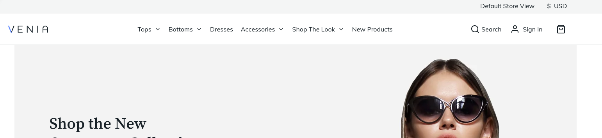
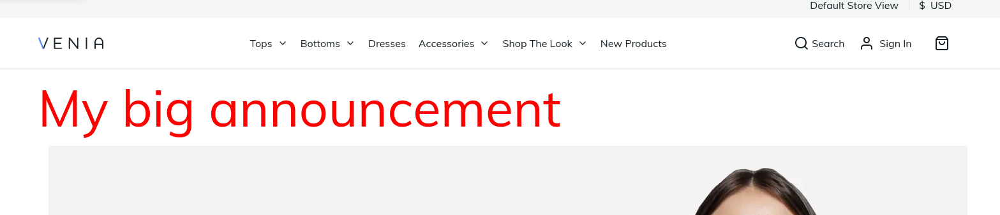

# Magento PWA Inject Custom Component

This project is an example on how to inject a custom component in a Magento PWA application.

The base application has been created using @magento/create-pwa (v2.1.0) with @magento/venia-concept template.

### Default home page

### Home page with custom component

## License

[MIT](https://choosealicense.com/licenses/mit/)

## References

- [Node.js Docker kickstarter](https://github.com/bmeme/docker-nodejs-kickstarter)
- [BMEME Digital Factory](https://www.bmeme.com)
- [Node.js Docker official images](https://hub.docker.com/_/node)
- [Magento PWA Studio](https://developer.adobe.com/commerce/pwa-studio/)
